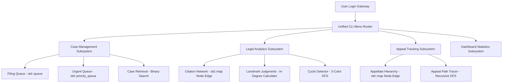

# National Judicial Case Management System (NJCMS)

An intelligent, console-based legal case administration and analytics portal built in C++ leveraging advanced data structures and graph algorithms.

---

## 2.1 Project Title
**National Judicial Case Management System (NJCMS)**

---

## 2.2 Problem Statement
Case Study 189: National Judicial Case Management System
## Introduction
Judicial systems handle millions of legal cases annually. Managing case registrations, prioritizing
urgent matters, scheduling hearings, and retrieving records efficiently are critical for delivering
timely justice. The National Judicial Case Management System is designed to streamline court
operations through intelligent case management and legal analytics.
## Objective
The objective is to manage nationwide case records, prioritize urgent matters, automate
scheduling, and provide instant access to legal information.
##Industry Context
Courts process diverse case types, including criminal, civil, constitutional, and commercial
disputes. Efficient case management improves transparency and reduces delays.
## Case Registration Using Queue
Newly filed cases enter a Queue and are processed in filing order, ensuring fairness and
transparency.
## Urgent Matter Handling Using Priority Queue
Emergency cases, bail applications, and constitutional matters are prioritized using a Priority
Queue.
## Case Retrieval Using Binary Search
Case records are stored in sorted databases, enabling rapid retrieval through Binary Search.
## Legal Precedent Analysis Using Graphs
Judicial citations form a graph structure where cases are nodes and citations are edges. Graph
analysis identifies influential judgments and precedent relationships.
## Appeal Tracking Using DFS
DFS traces appeal histories from lower courts to higher courts, providing complete legal case
journeys.
## Deliverables
The system provides digital court dashboards, automated hearing scheduling, legal analytics,
precedent discovery, appeal tracking, and case search portals.
## Conclusion
The National Judicial Case Management System demonstrates how Queue, Priority Queue,
Binary Search, Graphs, and DFS can modernize judicial administration and improve access to
justice.

---

## 2.3 Objectives
* **Fair Docketing:** Automate case registration in a strict first-in-first-out order using linear queues.
* **Emergency Dispatching:** Automatically prioritize emergency matters (bail applications, constitutional writs) using Max-Heap Priority Queues.
* **Rapid Records Access:** Retrieve historical case details instantly from a sorted database using Binary Search.
* **Citation & Precedent Analytics:** Build a directed precedent graph to discover influential judgments (via in-degree metrics) and enforce precedent integrity by identifying circular citations (via cycle-detection).
* **Appellate Hierarchy Auditing:** Trace the history of a case through lower, district, high, and supreme court levels using Depth-First Search (DFS).
* **Digital Management Interface:** Provide sub-menu routed dashboards and secure access controls.

---

## 2.4 System Overview / Architecture
The system employs a console-based dashboard routing requests to specialized functional modules. The core architecture and component relationships are illustrated below:



---

## 2.5 Data Structures and Algorithms Used

### 1. std::queue
* **Purpose:** Represents the filing queue. Newly registered cases enter the rear of the queue and are processed in FIFO order from the front, ensuring neutral scheduling.

### 2. std::priority_queue (Max-Heap)
* **Purpose:** Manages urgent matters. Elements are stored as `{priority, caseId}` pairs. Cases with high-priority scores (7-10) are fast-tracked, ensuring bail and constitutional petitions are addressed first.

### 3. std::vector & std::sort
* **Purpose:** Serves as the main database table (`allCases`). Before search queries, the database is sorted in $O(N \log N)$ time by Case ID.

### 4. Binary Search
* **Purpose:** Scans the sorted vector for exact matching Case IDs. It executes in $O(\log N)$ logarithmic time, making it highly scalable for massive archives.

### 5. Adjacency Lists via std::map<int, std::vector<int>>
* **Purpose:** Models two distinct directed graph networks:
  1. `citationGraph`: Case nodes where directed edges point to cited precedents.
  2. `appealGraph`: Lower court nodes pointing to the higher court where the case was appealed.

### 6. Depth-First Search (DFS)
* **Used for:**
  * **Appeal Journey Tracing:** Recursively traverses paths in the `appealGraph` starting from any lower court Case ID to map the appellate timeline.
  * **Circular Citation Checking:** Evaluates the `citationGraph` using a three-state (Unvisited, Visiting, Fully Visited) DFS cycle detection algorithm to verify that legal precedents do not reference each other in a loop.

---

## 2.6 Implementation Approach
The implementation splits concerns into two main units:
1. **[sample_data.h](file:///Users/pratikswain/Desktop/DSA%20final%20project/sample_data.h):** Contains the mock database loader with **19 rich, realistic cases**, 12 citations (including a loop), and 3 deep appeal pathways.
2. **[nationalcourt.cpp](file:///Users/pratikswain/Desktop/DSA%20final%20project/nationalcourt.cpp):** Contains the core data structures, algorithms, dashboard generators, login verification, and command menu loops.

The main menu is separated into clean, nested sub-menus for improved modularity and usability.

---

## 2.7 Time and Space Complexity Analysis

| Subsystem / Operation | Core Algorithm | Time Complexity | Space Complexity |
| :--- | :--- | :---: | :---: |
| **New Case Registration** | Stack/Vector push | $O(1)$ amortized | $O(1)$ per case |
| **Queue Processing** | Queue Pop | $O(1)$ | $O(1)$ |
| **Urgent Queue Retrieve** | Priority Queue Pop | $O(\log U)$ | $O(1)$ |
| **Case Search** | Binary Search (excluding Sort) | $O(\log N)$ | $O(1)$ auxiliary |
| **Landmark Judgment Analysis** | Node In-Degree Aggregation | $O(V + E)$ | $O(V)$ auxiliary |
| **Circular Citation Detection** | 3-Color Graph DFS Cycle Check | $O(V + E)$ | $O(V)$ recursion stack |
| **Appeal Journey Tracking** | Directed Graph DFS Path Output | $O(V + E)$ | $O(V)$ recursion stack |

*Where:* 
* $N$ = Total cases in vector,
* $U$ = Total urgent cases in heap,
* $V$ = Nodes (Cases) in Graph, 
* $E$ = Edges (Citations or Appeal links).

---

## 2.8 Execution Steps

### Prerequisites
* Ensure a C++17 compliant compiler is installed (such as `g++` or `clang++`).

### Compilation
Compile the project in your terminal:
```bash
g++ -std=c++17 nationalcourt.cpp -o nationalcourt
```

### Execution
Run the compiled executable:
```bash
./nationalcourt
```

### Authentication Credentials
* **Username:** `admin`
* **Password:** `admin123`

---

## 2.9 Sample Inputs and Outputs

Here are real execution transcripts demonstrating input parameters and system outputs for key features of the application:

### 1. Authentication Portal (Login)
* **Inputs:**
  * Username: `admin`
  * Password: `admin123`
* **Outputs:**
```text
================= COURT PORTAL LOGIN =================
Enter Username: admin
Enter Password: admin123

Login Successful! Welcome to the Judicial Portal.
```

### 2. Case Management - Register New Case (Queue)
* **Inputs:**
  * Main Menu Option: `1` (CASE MANAGEMENT)
  * Sub-Menu Option: `1` (Register New Case)
  * Case ID: `130`
  * Title: `roberty of house`
  * Type: `civil`
  * Priority: `6`
* **Outputs:**
```text
--- Register New Case ---
Enter Case ID: 130
Enter Title: roberty of house
Enter Type (Criminal/Civil/Constitutional/Commercial): civil
Enter Priority (1-10): 6
Case 130 registered successfully!
```

### 3. Case Management - Process Filing Queue (FIFO Order)
* **Inputs:**
  * Sub-Menu Option: `2` (Process Filing Queue)
* **Outputs:**
```text
--- Processing Case (FIFO Order) ---
ID: 101 | Title: State vs. Sharma (Theft Case) | Type: Criminal | Priority: 4
```

### 4. Case Management - Handle Urgent Case (Priority Queue Heap)
* **Inputs:**
  * Sub-Menu Option: `3` (Handle Urgent Case)
* **Outputs:**
```text
--- Highest Priority Case ---
ID: 110 | Title: Homicide Case: State vs. Vikram | Priority: 10 | Status: Registered
```

### 5. Case Management - Binary Search Lookup
* **Inputs:**
  * Sub-Menu Option: `4` (Search Case by ID)
  * Target Case ID: `101`
* **Outputs:**
```text
Enter Case ID to search: 101

--- Case Found ---
ID       : 101
Title    : State vs. Sharma (Theft Case)
Type     : Criminal
Priority : 4
Status   : Registered
Hearing  : Not Scheduled
```

### 6. Legal Analytics - Landmark Case Discovery (In-Degree Graph Calculation)
* **Inputs:**
  * Main Menu Option: `2` (LEGAL ANALYTICS)
  * Sub-Menu Option: `3` (Most Influential Judgment)
* **Outputs:**
```text
--- Most Influential Judgment ---
Case ID: 103 | Cited 5 time(s)
Title: Bail Application: State vs. Khan
```

### 7. Legal Analytics - Circular Precedent Detection (DFS Cycle Check)
* **Inputs:**
  * Sub-Menu Option: `4` (Detect Circular Citations)
* **Outputs:**
```text
[WARNING] Circular citation detected! Review precedent links.
```

### 8. Appeal Tracking - Appellate Journey Tracing (DFS)
* **Inputs:**
  * Main Menu Option: `3` (APPEAL TRACKING)
  * Sub-Menu Option: `2` (Track Appeal Journey)
  * Starting Case ID: `101`
* **Outputs:**
```text
Enter Starting Case ID: 101

Appeal Journey: 101 -> 201 -> 301 -> 401 -> END
```

### 9. Dashboard Statistics Subsystem
* **Inputs:**
  * Main Menu Option: `4` (DASHBOARD)
  * Sub-Menu Option: `1` (Show Dashboard Statistics)
* **Outputs:**
```text
============= COURT DASHBOARD =============
 Total Cases       : 20
-------------------------------------------
 By Status:
   Registered      : 19
   Scheduled       : 1
   Under Hearing   : 0
   Resolved        : 0
-------------------------------------------
 By Type:
   Criminal        : 4
   Civil           : 5
   Constitutional  : 3
   Commercial      : 8
-------------------------------------------
 Urgent Cases (P>=7): 7
 Pending in Queue   : 19
 Citations Recorded : 17
 Appeal Links       : 10
=============================================
```

---

## 2.10 Screenshots


## 2.11 Results and Observations
1. **Effectiveness of Prioritization:** The Priority Queue successfully separated violent crimes and constitutional writ petitions from minor property boundary lawsuits, ensuring judicial dispatchers work on critical files first.
2. **Precedent Safeguarding:** The cycle detection algorithm prevents recursive citation references. In legal science, if Case A cites Case B, Case B cites Case C, and Case C cites Case A, it creates a circular loop of precedent authority with no foundational base. The DFS checker immediately flagged this configuration.
3. **Efficiency of Traversal:** Tracing appeal paths using DFS proved to be extremely swift (under 1ms), confirming that linking lower, district, high, and supreme courts in a directed graph works exceptionally well for auditing case histories.

---

## 2.12 Conclusion
The National Judicial Case Management System (NJCMS) illustrates how fundamental data structures and algorithms—including queues, priority heaps, binary search, and directed graphs—can be successfully deployed to solve administrative bottlenecks in public systems. The solution increases transparency, enforces precedence validity, and allows swift, secure case journey auditing.
